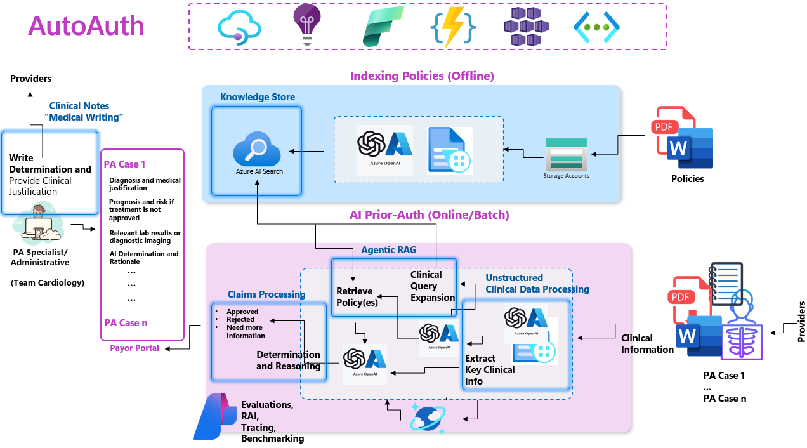

<div align="center">
  
</div>

<br>

> **Important Notice:**  
> New development and ongoing enhancements have migrated to the [Microsoft AutoAuth Repository](https://github.com/Azure-Samples/autoauth-solution-accelerator). For the latest updates and improved features, please refer to that repository.

🚀 **Welcome! Ready to streamline your Prior Authorization process?** Click below to get started with your deployment and unlock the full potential of AutoAuth.

<div align="center">
    <a href="https://pablosalvador10.github.io/gbb-ai-hls-factory-prior-auth/azd_deployment.html">
        
    </a>
    </a>
</div>

## 📚 Table of Contents

- [Overview](#-overview)
- [Introducing AutoAuth](#-introducing-autoauth)
- [Quick Start](#-quick-start)
    - [End-to-End Deployment Using AZD](https://pablosalvador10.github.io/gbb-ai-hls-factory-prior-auth/azd_deployment.html)
    - [PriorAuth SDK](#priorauth-sdk)
- [What's Next?](#-whats-next)
- [Contributors & License](#-contributors--license)

## 🌍 Overview

Prior Authorization (PA) is a critical step in healthcare delivery, requiring providers to seek approval from payors before offering certain treatments. While essential for cost control and care management, the current PA process is often manual, fragmented, and time-consuming:

- **Provider Burden**: Physicians handle an average of **41 PA requests per week**, consuming **13 hours**—almost two full working days—leading to high administrative burdens (88% of physicians report it as high or extremely high). [\[1\]](https://www.ama-assn.org/)
- **Payor Costs**: Up to 75% of PA tasks are manual, costing around **$3.14 per request**, and can be reduced by up to 40% through AI-driven automation. [\[2\]](https://sagilityhealth.com/) [\[3\]](https://www.mckinsey.com/)
- **Patient Outcomes**: **93% of physicians** state PA delays necessary care, and **82% of patients** sometimes abandon treatments due to these delays. Even a one-week delay in critical treatments like cancer can increase mortality risk by 1.2–3.2%. [\[1\]](https://www.ama-assn.org/) [\[3\]](https://www.mckinsey.com/)

This repository aims to **streamline and automate** the PA process using Azure AI, Agentic workflows, and advanced reasoning models. By leveraging machine learning, OCR, and agentic retrieval-augmented generation (RAG), we can reduce human labor, cut costs, and ultimately improve patient care.

<div align="center">
  
  <p style="font-size: smaller; font-family: cursive; font-style: italic; margin-top: 8px;">
    Tackling time-heavy tasks within the Prior Authorization workflow.
  </p>
</div>

**Note:** Our methodology, developed in collaboration with clinicals experts (MD and PharmD), is research-based and includes comprehensive case studies. For an in-depth understanding, please refer to our [article on Hashnode.](https://pabloaicorner.hashnode.dev/streamlining-prior-authorization-with-generative-ai).

## 🤖 Introducing AutoAuth

**AutoAuth** revolutionizes the Prior Authorization process through:

- **Intelligent Document Analysis**: OCR and LLM-driven extraction of clinical details from various document types.
- **Smart Policy Matching**: Agentic Rag laveraging Hybrid retrieval systems (Vector + BM25) identify relevant policies and criteria swiftly.
- **Advanced Reasoning Models**: Assess compliance against policies, recommend Approve/Deny decisions, or request additional info with full traceability.

<div align="center">
  
  <p style="font-size: smaller; font-family: cursive; font-style: italic; margin-top: 8px;">
    Solution Architecture
  </p>
</div>

**Note:** For comprehensive details, including technical architecture, customization steps, references, and additional documentation, please visit our **[GitHub Pages](https://pablosalvador10.github.io/gbb-ai-hls-factory-prior-auth)**.

<div align="center">
  <a href="https://player.vimeo.com/video/1040993686?h=f9c8e5ffba">
    
  </a>
  <p style="font-size: smaller; font-family: cursive; font-style: italic; margin-top: 8px;">
    Click the image to watch the AutoAuth App demo.
  </p>
</div>

## 🚀 Quick Start

### End-to-End Deployment Using AZD

> [!TIP]
> *Want to customize or learn more about configuration?*
> **[Read the detailed instructions on our GitHub Pages ➜](https://pablosalvador10.github.io/gbb-ai-hls-factory-prior-auth)**

More detailed documentation can be found in [docs/azd_deployment.md](docs/azd_deployment.md).

### PriorAuth SDK

You can seamlessly integrate Prior Authorization (PA) processing into your application using our SDK. The SDK allows you to run PA workflows programmatically, enabling you to automate the end-to-end process.

#### Example Usage

```python
from src.pipeline.paprocessing.run import PAProcessingPipeline

# Instantiate the PA processing pipeline
pa_pipeline = PAProcessingPipeline(send_cloud_logs=True)

# Run the pipeline with uploaded files
await pa_pipeline.run(uploaded_files=files, use_o1=True)
```
> [!TIP]
> To test the PA processing pipeline and get started, please refer to the notebook [`02-test-pa-workflow.ipynb`](./02-test-pa-workflow.ipynb).

#### ⚙️ Build and Expand the SDK

For those looking for greater flexibility, the AutoAuth SDK enables you to embed PA microservices into your existing applications. You can customize, integrate, and extend the PA workflows to suit your specific needs. This approach provides a highly modular, code-first experience for developers who want to build their own solutions.

#### Key Features of the AutoAuth SDK

- 📡 **Plug-and-Play API Integration with FastAPI**: Quickly expose Prior Authorization (PA) workflows as REST APIs, enabling system-to-system integrations.
- 🔄 **Modular and Extensible for Custom PA Workflows**: Customize and extend the SDK to fit your business logic and workflows.
- ⚡ **Rapid Deployment and Integration**: Minimal setup required to start automating PA workflows. Use FastAPI or other framework to expose endpoints and interact with the PA logic programmatically.

With the AutoAuth SDK, you have the flexibility to automate end-to-end Prior Authorization workflows or select specific components to integrate into your system. Whether you require a full application or a microservice solution, AutoAuth provides the tools you need.

**Note:** Detailed information, technical architecture, customization steps, references, and further documentation are available on our **[GitHub Pages](https://pablosalvador10.github.io/gbb-ai-hls-factory-prior-auth)**.

## ✅ What's Next?

### Near-Term Goals.
- [ ] **Agentic Framework Leveraging Semantic Kernel**: Integrate the Agentic framework component using the Semantic Kernel as the core for context-aware and intelligent agent orchestration.
- [ ] **API Management (APIM) Integration**: Introduce APIM for secure, scalable, and controlled access to the service’s endpoints.


## 🤝 Contributors & License

Please read through our [contributing guidelines](./CONTRIBUTING.md). Directions are included for opening issues, coding standards, and notes on development.

**License:** [MIT License](./LICENSE)

## Data Collection

 The software may collect information about you and your use of the software and send it to Microsoft. Microsoft may use this information to provide services and improve our products and services. You may turn off the telemetry as described in the repository. There are also some features in the software that may enable you and Microsoft to collect data from users of your applications. If you use these features, you must comply with applicable law, including providing appropriate notices to users of your applications together with a copy of Microsoft’s privacy statement. Our privacy statement is located at https://go.microsoft.com/fwlink/?LinkID=824704. You can learn more about data collection and use in the help documentation and our privacy statement. Your use of the software operates as your consent to these practices.

## Trademarks
This project may contain trademarks or logos for projects, products, or services. Authorized use of Microsoft trademarks or logos is subject to and must follow Microsoft’s Trademark & Brand Guidelines. Use of Microsoft trademarks or logos in modified versions of this project must not cause confusion or imply Microsoft sponsorship. Any use of third-party trademarks or logos are subject to those third-party’s policies.
