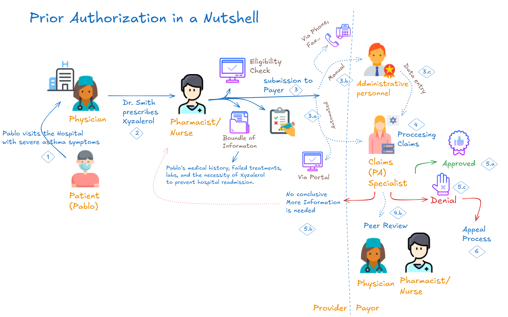

# 🔍 The Industry Problem, Challenges & Opportunities

Prior Authorization (PA) serves as a critical checkpoint before delivering certain healthcare treatments. Despite its importance, today’s PA processes are plagued by delays, manual reviews, and costly inefficiencies.

## Key Pain Points

- **Provider Burden**: Physicians handle ~41 PA requests/week, consuming ~13 hours, leading to administrative fatigue.  
- **Payor Inefficiencies**: Up to 75% of PA tasks remain manual, costing payors ~$3.14 per request.  
- **Patient Impact**: 93% of physicians report PA delays patient care; many patients abandon treatment due to long waiting times.

## Regulatory and Industry Trends

- **Mandates for Transparency**: Emerging standards like CMS rules push for greater data sharing, FHIR-based APIs, and faster turnaround times.
- **Demand for Automation**: Growing interest in AI/ML to reduce manual tasks, cut costs, and improve accuracy.

## References

1. [American Medical Association](https://www.ama-assn.org/)  
2. [Sagility Health](https://sagilityhealth.com/)  
3. [McKinsey AI Insights](https://www.mckinsey.com/)