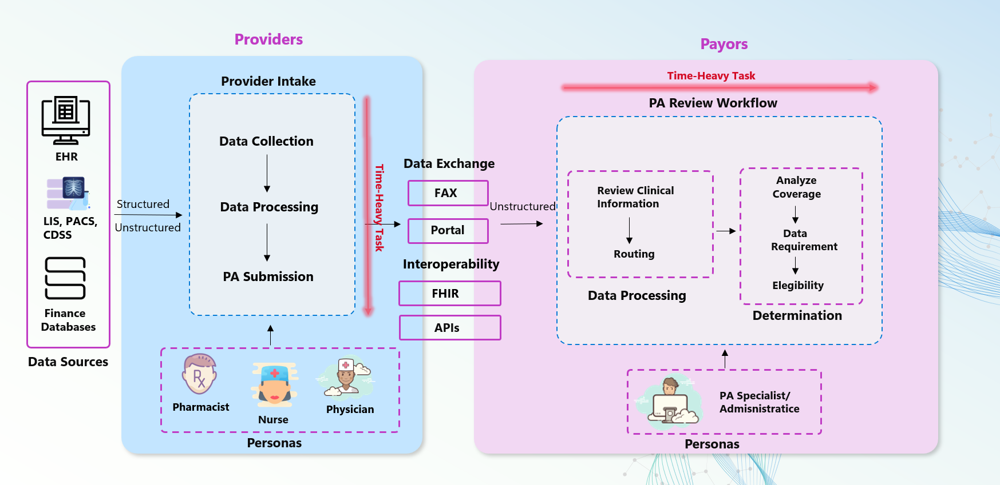

# 🚀 **Streamlining Prior Authorization with Azure AI** 

---

## 🔍 Overview  

Prior Authorization (PA) is a process in healthcare where providers must seek approval from payors (insurance companies) before delivering specific treatments or medications. While essential for cost control and care management, the process has become inefficient, creating substantial delays, administrative overheads, and negative outcomes for all stakeholders—providers, payors, and patients.

{: width="600" align="center" style="padding: 10px;"}

---

### 🌟 Navigation  

1. **[PA: The Industry Problem, Challenges & Opportunities](challenges.md)**
2. **[AutoAuth Solution](autoauth_solution.md)**  
3. **[Technical Architecture](technical_architecture.md)**  
4. **[Deployment](deployment.md)**  

---