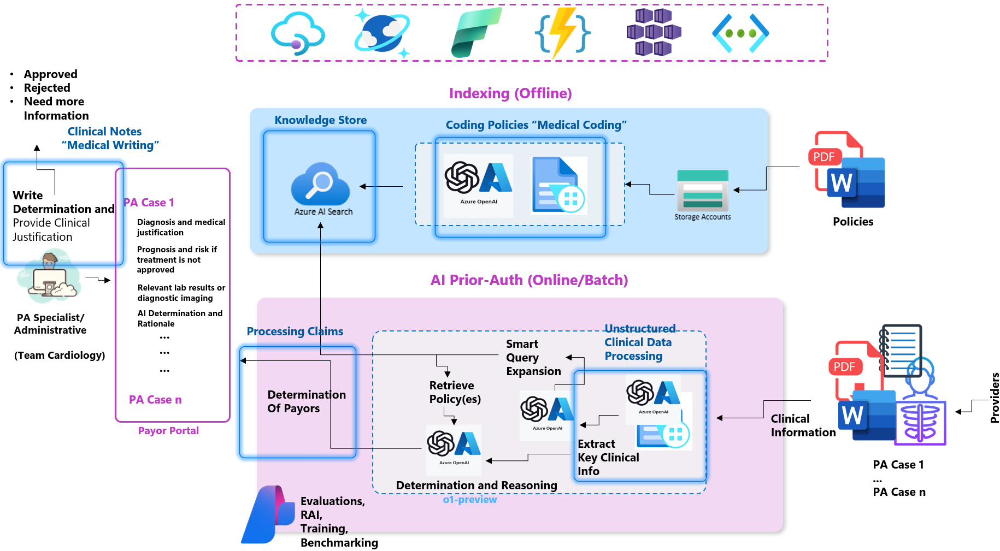

# 🤖 The AutoAuth Solution

**AutoAuth** transforms the traditional PA process by integrating AI-driven document analysis, policy retrieval, and advanced reasoning models. This approach minimizes manual workload and accelerates decision-making.

## Core Methodology

1. **Data Extraction & Structuring**:  
   - Use OCR and Azure Document Intelligence to convert unstructured data (PDFs, clinical notes) into structured JSON.
   - LLM-driven extraction identifies ICD-10 codes, lab results, and other clinical entities.

2. **Policy Matching & Hybrid Retrieval**:  
   - Combine vector embeddings with BM25 lexical search in Azure Cognitive Search.
   - Quickly find relevant policies and criteria for each PA request.

3. **Reasoning & Decision Support**:  
   - Employ Azure OpenAI LLM models for policy assessment.
   - Agentic interactions, facilitated by Semantic Kernel, orchestrate retrieval, reasoning, and decision paths.

## Enhanced Capabilities

- **LLMOps with AI Studio**: Continuously evaluate model performance, refine prompts, and implement best practices for stable, reliable AI operations.
- **Research-Driven Prompts**: Fine-tuned prompt strategies reduce hallucinations and improve decision alignment with clinical and policy guidelines.
- **Scalable & Configurable Infrastructure**: One-click deployment with Azure Bicep templates and modular architecture for easy extension.

By uniting these components, AutoAuth delivers a faster, more accurate, and patient-centered PA workflow.