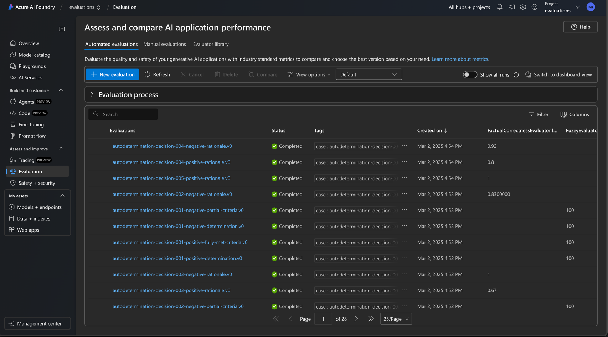

# AutoAuth Evaluation Framework

This repository provides a configuration-driven approach to defining and executing evaluation cases for generative AI tasks within the `AutoAuth` framework. By separating evaluation configurations from the implementation code, the framework promotes flexibility, maintainability, and scalability. Each test case is defined as a YAML configuration file, while the evaluation logic is encapsulated within dedicated Python modules—each containing an `evaluator.py` file.

---

## Overview

The YAML schema is designed to decouple test configurations from the codebase. This enables developers and evaluators to update test parameters, metadata, and evaluation expectations without modifying the underlying pipeline logic. This approach follows best practices observed in systems like Kubernetes and Django, where configurations are externalized for clarity and maintainability.

### Key Advantages

- **Separation of Concerns:**  
  Code handles execution while YAML files drive test definitions.
- **Flexibility:**  
  Each evaluation case can define its own evaluators, arguments, and context to accommodate diverse AI evaluation scenarios.
- **Scalability:**  
  New evaluation cases or modules can be integrated without altering core pipeline code.

---

## Definitive YAML Schema Specification

The YAML configuration files consist of two primary sections:
1. **Test Evaluation Configuration**
2. **Case-Specific Configuration**

### 1. Test Evaluation Configuration

#### Mandatory Fields

| Field           | Description                                                                                                                                                                                                                                                                   | Notes       |
| --------------- | ----------------------------------------------------------------------------------------------------------------------------------------------------------------------------------------------------------------------------------------------------------------------------- | ----------- |
| **description** | - A human-readable explanation of the evaluation’s purpose.                                                                                                                                                                                                                  | Mandatory   |
| **pipeline**    | **Sub-fields:** <br> - **class:** Fully qualified evaluator class name (format: `module_path:ClassName`). <br> - **uploaded_files** / **case_id** / **scenario:** Parameter(s) required by the evaluator.                                                               | Mandatory   |
| **evaluators**  | A list of evaluator definitions. Each evaluator must include: <br> - **type:** Evaluator type (e.g., "azure" or "custom"). <br> - **name:** Unique identifier for the evaluator. <br> - **class:** Fully qualified class reference (format: `module_path:ClassName`). | Mandatory   |
| **cases**       | A list of case identifiers that reference detailed case-specific configurations.                                                                                                                                                                                             | Mandatory   |

#### Optional Fields

| Field         | Description                                                                                                                                                                             | Notes      |
| ------------- | --------------------------------------------------------------------------------------------------------------------------------------------------------------------------------------- | ---------- |
| **disclaimer**| - A note regarding limitations or special conditions of the evaluation.                                                                                                               | Optional   |
| **args**      | - Additional key-value pairs passed to evaluator constructors. <br> - Used for evaluator-specific configuration (e.g., thresholds, model configurations, etc.).                     | Optional   |

### 2. Case-Specific Configuration

Each case identifier from the Test Evaluation Configuration must have a corresponding section that details the specific test case.

**Mandatory Fields:**

- **metrics** (list):  
  - A list of evaluator names to be applied to the test case (must match those defined above).

- **evaluations** (list):  
  - Each evaluation item must include:
    - **query** (string, mandatory): The output field key for evaluation (e.g., "patient_information.patient_name").
    - **ground_truth** (string, mandatory): The expected value for the query.

**Optional Fields:**

- **Custom evaluator settings:**  
  - Additional configuration for specific evaluators can be provided using the evaluator's unique name as a key.
- **context** (object):  
  - A mapping used for creating context objects. The key should follow the format "module_path:ClassName" and the value an object with initialization parameters.
- **conversation, scores** (object):  
  - Additional optional details to capture the evaluation process.

### Example Definitive YAML Schema

Below is an annotated YAML snippet illustrating the schema with both mandatory and optional fields:

```yaml
# --- Test Evaluation Configuration ---
evaluation_id:
  description: >
    [MANDATORY] A brief explanation of what this evaluation verifies.
  disclaimer: >
    [OPTIONAL] Any notes on limitations or conditions.
  pipeline:
    class: [MANDATORY] src.pipeline.<ModuleName>.evaluator.<EvaluatorClassName>
    uploaded_files: [MANDATORY/Conditional] "path/to/documents"  # Adjust based on evaluator requirements
    # Alternatively, use 'case_id' and 'scenario' as needed
  evaluators:
    - type: [MANDATORY] "azure" or "custom"
      name: [MANDATORY] "EvaluatorUniqueName"
      class: [MANDATORY] module_path:EvaluatorClassName
      args: [OPTIONAL]
        # Example: Key-value pairs for evaluator-specific configuration
        threshold: 95.0
  cases:
    - evaluation_id.v0

# --- Case-Specific Configuration ---
evaluation_id.v0:
  metrics: [MANDATORY] [EvaluatorUniqueName, ...]
  # Custom evaluator settings [OPTIONAL]
  EvaluatorUniqueName:
    threshold: 95.0
  evaluations:
    - query: [MANDATORY] "field.key.path"
      ground_truth: [MANDATORY] "expected value"
      # Optional fields:
      context: [OPTIONAL] >
        Additional context if needed.
```

For an example YAML configuration, please refer to the file located at `evals/cases/_yaml.example`.

---

## AI Foundry Integration

Each and every test case is integrated with the appropriate evaluator metric and made available in AI Foundry, to be used to catalog and evaluate the performance of the generative AI models on a change-by-change basis. We use the tags feature to group the test cases by their respective pipeline, and the evaluation_id to identify the test case.




---

## Pipeline Evaluator Implementation

At the core of the evaluation process is the abstract class `PipelineEvaluator` (located in `src/evals/pipeline.py`). This base class enforces a standard workflow that includes:

1. **Preprocessing:**  
   Loads YAML configurations, instantiates evaluators, and prepares data.  
   _Method to implement: `async def preprocess(self)`_

2. **Run Evaluations:**  
   Processes test cases and triggers the evaluation logic (e.g., via the Azure AI evaluation API).  
   _Method to implement: `async def run_evaluations(self)`_

3. **Post Processing:**  
   Aggregates, processes, and summarizes evaluation results.  
   _Method to implement: `def post_processing(self) -> dict`_

These steps are orchestrated by the **final** method `run_pipeline()`, which must not be overridden. This design guarantees a consistent execution order across all evaluator implementations.

**Model Configuration Handling:**  
The `PipelineEvaluator` class supports clean handling of the `model_config` parameter for evaluators. Within the `_instantiate_evaluators()` method, if an evaluator's constructor expects a `model_config` parameter and it is not provided in the YAML configuration (under `args`), the framework automatically populates `model_config` using environment variables (e.g., `AZURE_OPENAI_ENDPOINT`, `AZURE_OPENAI_KEY`, and `AZURE_OPENAI_DEPLOYMENT`). This approach allows model-specific configurations to be either explicitly defined in the YAML configuration or seamlessly injected during the preprocessing steps.

---

## Contribution Guidelines

Contributions to the framework should adhere to these principles:

- **Configuration vs. Code:**  
  Test cases and evaluation parameters belong in YAML files. Evaluator classes should interpret these configurations and apply corresponding logic, ensuring that changes in testing scenarios do not require code modifications.

- **Implementing Custom Evaluators:**  
  When adding a new custom evaluator, create an evaluator class (typically in your module’s `evaluator.py`) that inherits from `PipelineEvaluator`. Your class must implement:
  - `async def preprocess(self)`
  - `async def run_evaluations(self)`
  - `def post_processing(self) -> dict`
  - Optionally, implement `async def generate_responses(self, **kwargs) -> dict` for dynamic response generation.
  
  **Note:** Do not override the `run_pipeline()` method. It is defined as `final` to enforce the standard three-step process.

- **Best Practices:**  
  Externalizing test cases in YAML follows industry standards (e.g., the Twelve-Factor App methodology) and results in:
  - Improved maintainability.
  - Easier updates and debugging.
  - Enhanced scalability for new evaluation scenarios or dependencies.

---

## Test Cases Overview

The test cases are structured as follows:
- **Case ID:** Unique identifier (e.g., 001-a, 001-b, …, 005-b)
- **Diagnosis:** The medical condition being tested
- **Medication Request:** The prescribed medication
- **Expected AutoAuth Decision:** The expected outcome (Approval or Denial)
- **Actual AutoAuth Decision and Reasoning:** The system’s decision along with detailed reasoning
- **Average Time to Decision:** The average processing time for the request

### Test Coverage

The following test cases are currently evaluating correctly and considered covered:

| Case ID | Diagnosis | Medication Request | Expected AutoAuth Decision | Actual AutoAuth Decision and Reasoning | Average Time to Decision |
|---------|-----------|--------------------|----------------------------|----------------------------------------|--------------------------|
| 001-a   | Inflammatory Bowel Disease (Crohn’s) | Adalimumab | Approval | “The patient meets all necessary requirements. She is over 6 years old, has tried corticosteroid therapy without improvement, and the medication is prescribed by a pediatric gastroenterologist. Therefore, the prior authorization request should be approved.” | 78 seconds |
| 001-b   | Inflammatory Bowel Disease (Crohn’s) | Adalimumab | Denial   | “The PA request is denied. The patient does not meet all the criteria outlined in the policy for initial therapy in Crohn's disease. Specifically, there is no evidence that the patient has tried or is currently taking corticosteroids or another conventional systemic therapy, nor does she meet any alternative criteria under criterion ii. Additionally, the prescribing physician is a pediatrician, not specified as a gastroenterologist, which does not meet criterion iii.” | 84 seconds |
| 002-b   | Lennox-Gastaut Syndrome  | Epidiolex   | Denial    | “The patient has not demonstrated trial or concomitant use of at least two other anti-seizure medications, and the medication is not prescribed by or in consultation with a neurologist. The PA request is denied.” | 81 seconds |
| 003-a   | Lymphoblastic Leukemia (B-ALL), Philadelphia chromosome-negative | Blinatumomab | Approval  | “The PA request is approved. The patient meets all the necessary criteria outlined in the policy for Blincyto use in B-cell precursor acute lymphoblastic leukemia (B-ALL) in remission but positive for minimal residual disease (MRD+).” | 80 seconds |
| 003-b   | Lymphoblastic Leukemia (B-ALL), Philadelphia chromosome-positive | Blinatumomab | Denial  | “The patient does not meet all the criteria outlined in the policy. Specifically, for Philadelphia chromosome-positive (Ph+) relapsed or refractory B-cell precursor acute lymphoblastic leukemia (B-ALL), the policy requires that the patient is intolerant or refractory to at least one second-generation or later tyrosine kinase inhibitor (TKI). There is no documentation that the patient has tried a second-generation or later TKI; the patient has only been treated with imatinib, a first-generation TKI. Therefore, the PA request does not meet the necessary criteria for approval.” | 98 seconds |
| 004-a   | Severe Atopic Dermatitis | Dupilumab   | Approval  | “The PA request meets all the necessary requirements and is approved. The patient has a documented diagnosis of severe atopic dermatitis, has failed to achieve adequate control with two specified classes of topical therapies, is not receiving prohibited concurrent medications, and the prescribing physician is appropriately specialized.” | 77 seconds |
| 004-b   | Severe Atopic Dermatitis | Dupilumab   | Denial    | “The PA request does not meet all the necessary criteria outlined in the policy for atopic dermatitis. Specifically, the patient has a history of failure with only one class of topical therapy, whereas the policy requires a history of failure, contraindication, or intolerance to two specified classes of topical therapies.” | 76 seconds |
| 005-a   | High-grade Osteosarcoma   | Everolimus  | Approval  | “The PA request for Afinitor (everolimus) is approved. The patient meets all the necessary criteria outlined in the policy for the use of Afinitor in combination with Nexavar (sorafenib) for metastatic osteosarcoma as second-line therapy.” | 71 seconds |

## Work in Progress

The following test cases are currently under evaluation due to discrepancies and are planned on resolving in future release:

| Case ID | Diagnosis | Medication Request | Expected AutoAuth Decision | Actual AutoAuth Decision and Reasoning | Average Time to Decision |
|---------|-----------|--------------------|----------------------------|----------------------------------------|--------------------------|
| 002-a   | Lennox-Gastaut Syndrome  | Epidiolex   | Approval  | “The PA request is approved. The patient meets all the necessary criteria outlined in the policy for Lennox-Gastaut Syndrome. The patient is a 2-year-old diagnosed with Lennox-Gastaut Syndrome. The patient has tried or is currently receiving at least two other antiseizure medications (valproic acid, lamotrigine, rufinamide, topiramate). The prescribing physician is a pediatric neurologist.” | 62 seconds |
| 005-b   | High-grade Osteosarcoma   | Everolimus  | Denial    | “The PA request for Afinitor (everolimus) is denied because it does not meet all the necessary criteria outlined in the policy for the treatment of osteosarcoma. Specifically, the policy requires that Afinitor be used in combination with Nexavar (sorafenib) for this indication, and there is no evidence provided that Nexavar is part of the treatment pla…” | (Incomplete) |

---

## Usage

To run the evaluations for specific pipelines, set the necessary environment variables and execute the corresponding evaluator script.

**For the `agenticRag` evaluation pipeline:**

```bash
export AZURE_OPENAI_ENDPOINT="https://foundryinstance12345.openai.azure.com" && \
export AZURE_OPENAI_KEY="<scrubbed>" && \
export AZURE_OPENAI_DEPLOYMENT="gpt-4o" && \
export AZURE_AI_FOUNDRY_CONNECTION_STRING="eastus2.api.azureml.ms;28d2df62-e322-4b25-b581-c43b94bd2607;rg-priorauth-eastus2-hls-autoauth;evaluations" && \
export PYTHONPATH="/Users/marcjimz/Documents/Development/gbb-ai-hls-factory-prior-auth:$PYTHONPATH" && \
python src/pipeline/agenticRag/evaluator.py
```

**For the `clinicalExtractor` evaluation pipeline:**

```bash
export AZURE_OPENAI_ENDPOINT="https://foundryinstance12345.openai.azure.com" && \
export AZURE_OPENAI_KEY="<scrubbed>" && \
export AZURE_OPENAI_DEPLOYMENT="gpt-4o" && \
export AZURE_AI_FOUNDRY_CONNECTION_STRING="eastus2.api.azureml.ms;28d2df62-e322-4b25-b581-c43b94bd2607;rg-priorauth-eastus2-hls-autoauth;evaluations" && \
export PYTHONPATH="/Users/marcjimz/Documents/Development/gbb-ai-hls-factory-prior-auth:$PYTHONPATH" && \
python src/pipeline/clinicalExtractor/evaluator.py
```

**For the `autoDetermination` evaluation pipeline:**

```bash
export AZURE_OPENAI_ENDPOINT="https://aoai-ai-factory-eus-dev.openai.azure.com" && \
export AZURE_OPENAI_API_VERSION="2023-05-15" && \
export AZURE_OPENAI_CHAT_DEPLOYMENT_ID="gpt-4o-standard" && \
export AZURE_OPENAI_CHAT_DEPLOYMENT_01="o1-preview" && \
export AZURE_OPENAI_KEY="" && \
export AZURE_OPENAI_API_VERSION_01="2024-09-01-preview" && \
export export AZURE_AI_FOUNDRY_CONNECTION_STRING="eastus2.api.azureml.ms;28d2df62-e322-4b25-b581-c43b94bd2607;rg-priorauth-eastus2-hls-autoauth;evaluations" && \
python src/pipeline/autoDetermination/evaluator.py
```

To run the e2e tests:

```bash
export AZURE_OPENAI_ENDPOINT="https://aoai-ai-factory-eus-dev.openai.azure.com" && \
export AZURE_OPENAI_API_VERSION="2023-05-15" && \
export AZURE_OPENAI_CHAT_DEPLOYMENT_ID="gpt-4o-standard" && \
export AZURE_OPENAI_CHAT_DEPLOYMENT_01="o1-preview" && \
export AZURE_OPENAI_KEY="" && \
export AZURE_OPENAI_API_VERSION_01="2024-09-01-preview" && \
export export AZURE_AI_FOUNDRY_CONNECTION_STRING="eastus2.api.azureml.ms;28d2df62-e322-4b25-b581-c43b94bd2607;rg-priorauth-eastus2-hls-autoauth;evaluations" && \
export AZURE_OPENAI_DEPLOYMENT="gpt-4o-standard" && \
export PYTHONPATH="/Users/marcjimz/Documents/Development/gbb-ai-hls-factory-prior-auth:$PYTHONPATH" && \
pytest --log-cli-level=DEBUG
```


Make sure to update the environment variables according to your system configuration and connection details.